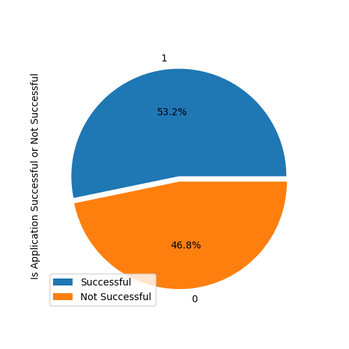
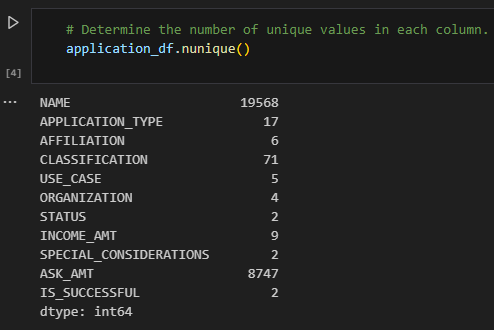
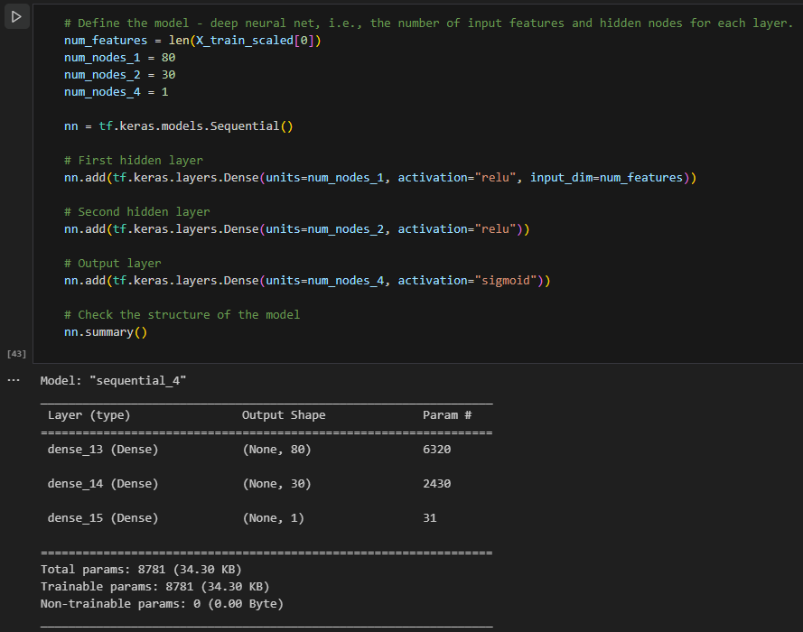
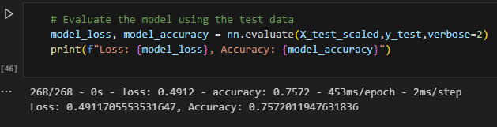

# deep-learning-challenge
Module 21

## Overview ##
This deep learning model was created to analysis whether applicants would be successful if funded by Alphabet Soup.

## Results ##

### Data Preprocessing ###

* The target variable is "IS_SUCCESSFUL". 
* The feature variables include name, application type, affilcation, classification, use case, organization, status, income amount, special considerations, and ask amount. Name was removed in the original model and added back in the optimization model. 
* EIN (employer identification number) was removed because it is an indentification column.

 

### Compiling, Training, and Evaluating the Model ###

* The optimization model includes three layers with nodes 80, 30, and 1 respectfully. The number of input neurons is equal to the number of features (78 in optimization version). The activation functions utilized were relu and sigmoid.

* Target model performance of above 75% accuracy was achieved. 

* Several steps were taken to increase model performance.
    * Data: The Name column was added back during the optimization model and was binned to decrease overall numbers of values. This increased accuracy by ~2%. The classification bin was increased to allow for several more values. Income amount was binned to decrease number of values. Ask amount was also binned however this did not alter the accuracy of the model and was ultimately removed.

    * Model: Higher and lower number of nodes were tested but resulting in lower accuracy scores. Adding hidden layers were attempted but this decreased the overall accuracy slightly. Epochs of 20, 40, 100 and 200 were tested. All attempts gave a differences of 0.2-0.4%. Epochs of 20 were chosen for efficiency.

## Summary ##
Overall, the optimized model achieved the desired accuracy performance of above 75%. It achieved 75.3-75.7%. If desired for higher accuracy, another model such as Random FOrest could be performed. Random FOrest will provide an accurate predication and also increaser rate of preventing overfitting.

Summary: Summarize the overall results of the deep learning model. Include a recommendation for how a different model could solve this classification problem, and then explain your recommendation.

## Resources ##
* Referenced lesson activities from Module 19, 20 and 21 Machine Learning.
* Plotly coding for IS_SUCCESSFUL preview: https://www.datacamp.com/blog/classification-machine-learning
